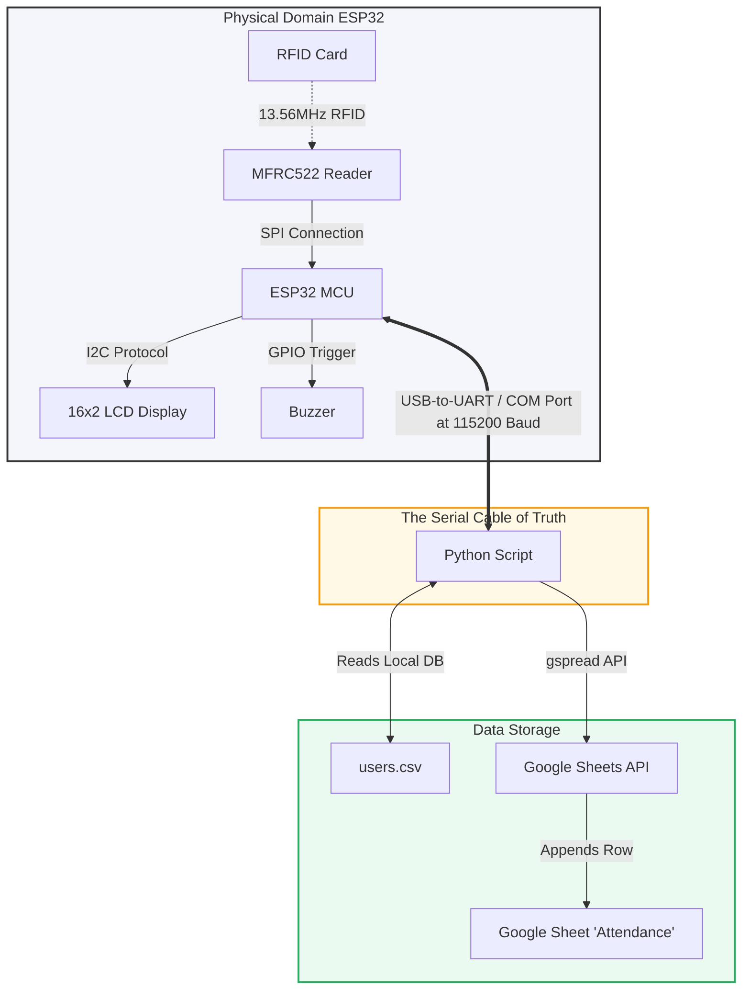
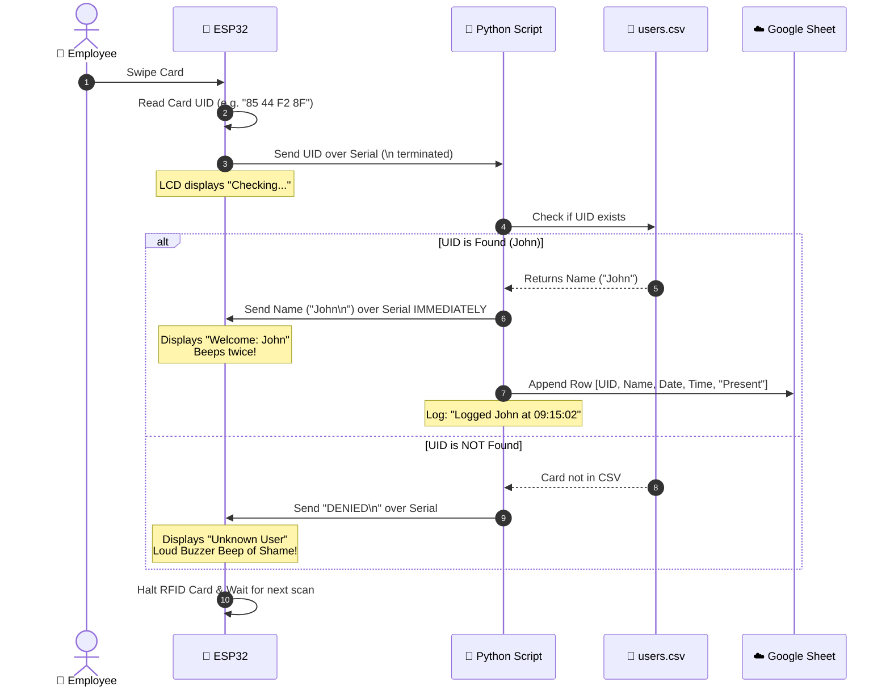

# 📡 RFID-to-Google-Sheets Attendance Logger
### *Otherwise known as the "Is Anyone Actually in the Office or Are They All WFH?" Machine.*

---

Welcome! If you are here, it’s probably because you want to track attendance using plastic cards, an ESP32 micro-controller, and Google Sheets—meaning you want to feel like a high-tech corporate overlord while spending exactly $0 on commercial enterprise software.

This repository contains a simple yet surprisingly robust **RFID Attendance System** that bridges the physical world (swiping an RFID card) to the cloud (updating a Google Sheet) using a magical thread called **Serial Communication** (running over a USB cable). 

---

## 🏗️ System Architecture

This project is built like a delicate three-layered cake. If any layer falls, the whole cake collapses and your LCD screen will angrily scream at you.



1. **The Physical Layer (ESP32 + Sensors)**: Detects your RFID card, grabs its unique ID (UID), prints it over the serial connection, and waits like a loyal dog for the PC to reply. Once the PC replies, it updates the LCD display and triggers success beeps (or a loud buzz of shame if you aren't registered).
2. **The Serial Bridge (Python)**: Acts as the middle manager. It listens to the USB port, grabs the card UID, looks it up in a local database (`users.csv`), immediately tells the ESP32 if the user is allowed in, and then silently reports the transaction to the cloud.
3. **The Cloud Layer (Google Sheets)**: A Google Spreadsheet that acts as your database because setting up a real database (like PostgreSQL) requires too many configuration files and we value our sanity.

---

## 🔄 The Lifecycle of a Card Swipe (Flow Chart)

Here is a sequence diagram showing what happens behind the scenes in the span of roughly 0.5 seconds when you scan a card:



---

## 🔌 Environment Setup & Hardware Wiring

### 1. The Hardware Hookup
This project is configured specifically for an **ESP32** (looking at you, Pins 21 and 22). If you are using a standard Arduino Uno or Nano, you'll need to modify the I2C pins and SPI pins in the `.ino` file, but if you're on a standard ESP32 development board, wire it exactly like this:

| Component | ESP32 Pin | RFID RC522 Pin | LCD (I2C Backpack) | Buzzer |
| :--- | :--- | :--- | :--- | :--- |
| **3.3V** | 3.3V | 3.3V | - | - |
| **5V** | VIN / 5V | - | VCC | - |
| **GND** | GND | GND | GND | Negative (Short Leg) |
| **MFRC522 RST** | GPIO 4 | RST | - | - |
| **MFRC522 SDA/SS**| GPIO 5 | SDA / SS | - | - |
| **MFRC522 MOSI**| GPIO 23 | MOSI | - | - |
| **MFRC522 MISO**| GPIO 19 | MISO | - | - |
| **MFRC522 SCK** | GPIO 18 | SCK | - | - |
| **I2C SDA** | GPIO 21 | - | SDA | - |
| **I2C SCL** | GPIO 22 | - | SCL | - |
| **Buzzer Signal**| GPIO 15 | - | - | Positive (Long Leg) |

> [!WARNING]
> Do **NOT** connect the MFRC522 RFID reader's 3.3V pin to the ESP32's 5V pin. It will smoke, and electronics run on blue smoke—once the smoke escapes, they stop working!

---

### 2. Software Requirements

#### 💻 PC / Python Side
You need Python 3 installed. If you don't have it, go download it and remember to check the checkbox that says **"Add Python to PATH"** (a mistake we have all made and regretted).

Open your terminal (PowerShell, Command Prompt, or terminal of choice) and install the dependencies:
```bash
pip install pyserial gspread oauth2client
```

#### 🔌 Arduino IDE Side
Open Arduino IDE and install the following libraries via the Library Manager (`Ctrl + Shift + I`):
1. **MFRC522** (by GithubCommunity)
2. **LiquidCrystal_I2C** (by Frank de Brabander)

---

### 3. ☁️ Google Cloud Setup (The "Hard" Part)
Because Google cares about security, you cannot just tell Python "please write to this spreadsheet." You have to create a **Service Account** to act as a virtual assistant.

1. Go to the [Google Cloud Console](https://console.cloud.google.com/).
2. Create a new project (call it something professional, like `RFID-Attendance-System`).
3. Search for **Google Drive API** and enable it.
4. Search for **Google Sheets API** and enable it.
5. Go to **APIs & Services > Credentials** and click **Create Credentials > Service Account**.
6. Give your service account a name, click **Create and Continue**, and finish the wizard.
7. Click on your newly created service account, go to the **Keys** tab, click **Add Key > Create New Key**, select **JSON**, and download it.
8. Rename this downloaded file to `credentials.json` and place it in the `RFID-main` directory next to `attendence.py`.
9. Open the JSON file, copy the `client_email` value (looks like `something@your-project.iam.gserviceaccount.com`).
10. Go to Google Sheets, create a spreadsheet named `Attendance`.
11. Click **Share** (top-right) and share the sheet with that `client_email` address as an **Editor**.

---

## 🚀 How to Run the System

Now that you've wired everything and suffered through Google's developer console, it's time to run it!

### Step 1: Upload the Arduino Sketch
1. Connect your ESP32 to your PC using a micro-USB (or USB-C) cable.
2. Open `RFID-main/RFID.ino` in Arduino IDE.
3. Select your ESP32 board and the correct COM port from the `Tools` menu.
4. Click **Upload** (`Ctrl + U`) and wait until it says "Done uploading."
5. Check the physical LCD display. It should say:
   ```text
   Scan Your Card
   ```

### Step 2: Configure the local Database
Open `RFID-main/users.csv`. It contains your local card registry:
```csv
UID,Name
85 44 F2 8F,John
```
Whenever you scan a card that hasn't been registered yet, the Python terminal will print:
`❌ Unknown Card: XX XX XX XX`
Simply copy that UID, add a new line in `users.csv` in the format `UID,Name` (e.g. `AA BB CC DD,Sarah`), save the file, and restart the Python script.

### Step 3: Run the Python Script
1. Open `RFID-main/attendence.py`.
2. Look at line 10:
   ```python
   COM_PORT = 'COM5'       # <--- CHECK THIS
   ```
   Is your ESP32 actually on `COM5`? Statistically, it's probably on `COM3`, `COM7`, or `COM21`. Go to Device Manager (on Windows) or run `ls /dev/tty*` (on Mac/Linux) to find the correct port, and change it in the script.
3. Open your terminal in the directory where `attendence.py` resides, and run:
   ```bash
   python attendence.py
   ```
4. If everything is correct, the terminal will print:
   ```text
   ✅ Connected to Google Sheets!
   ✅ Database Loaded (1 users).
   ✅ Connected to COM5. Ready to scan...
   ------------------------------------------------
   ```

### Step 4: Swipe and Enjoy
Go ahead! Swipe a registered card.
- **The LCD** will instantly say `Welcome:` followed by your name.
- **The Buzzer** will happily beep twice.
- **Your terminal** will print: `☁️ Logged: John at 09:15:02`.
- **Your Google Sheet** will magically populate with a new row!

---

## 🛠️ Comical Troubleshooting Guide

Things will go wrong. They always do. Here’s how to fix them:

### 1. The LCD displays `PC Error`
* **What it means**: The ESP32 sent the card UID to your computer, but your computer ignored it. 
* **The fix**: 
  - Is the Python script running? If not, start it.
  - Is your Python script using the same `COM_PORT` that the ESP32 is plugged into?
  - Did the Python script crash because you forgot to create/share `credentials.json`? Check the console.

### 2. Python crashes with `serial.serialutil.SerialException: Permission error`
* **What it means**: Only one program can talk to a serial port at a time.
* **The fix**: You probably left the Arduino IDE **Serial Monitor** open. Close the Serial Monitor and run the Python script again. They cannot share the port!

### 3. Python prints `❌ Google Error: ...` on startup
* **What it means**: Google API credentials are wrong, or you named your spreadsheet something else.
* **The fix**: 
  - Verify that your spreadsheet is named **exactly** `Attendance` (case-sensitive).
  - Verify that you shared the Google Sheet with the email inside your `credentials.json`.
  - Verify that you placed `credentials.json` in the correct folder.

### 4. Buzzer screams continuously or makes no sound
* **What it means**: Your wiring is wrong, or you have a passive buzzer and you are sending a flat high signal instead of a PWM frequency.
* **The fix**: The code uses a simple `digitalWrite(BUZZER_PIN, HIGH)` which works perfectly with an **Active Buzzer** (the ones that beep automatically when they get power). If you have a **Passive Buzzer** (just a tiny speaker), you'll hear a sad, quiet click. Replace it with an active buzzer, or change the Arduino code to use `tone(BUZZER_PIN, 2000)` instead of `digitalWrite`.

---

## 📽️ Media Showcase
Check out these assets in the repository folder to see how the completed project looks:
* **The final setup wiring screenshot**: See `scrnshot.jpeg` or `Screensht.png`.
* **The system in action**: Watch `Untitled design.mp4` to hear the sweet, sweet sound of success beeps.

---
*Made with ☕, serial port debugging tears, and a healthy fear of manual data entry.*
